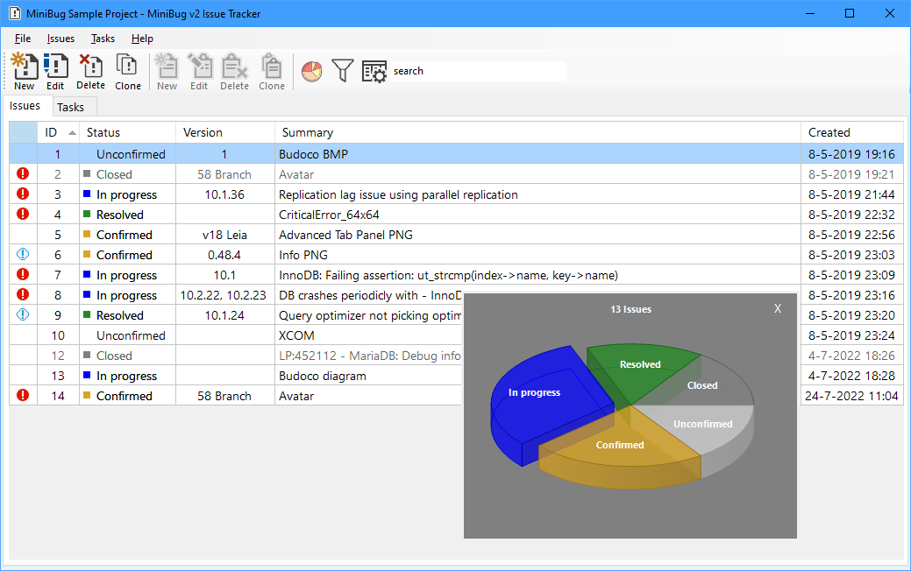
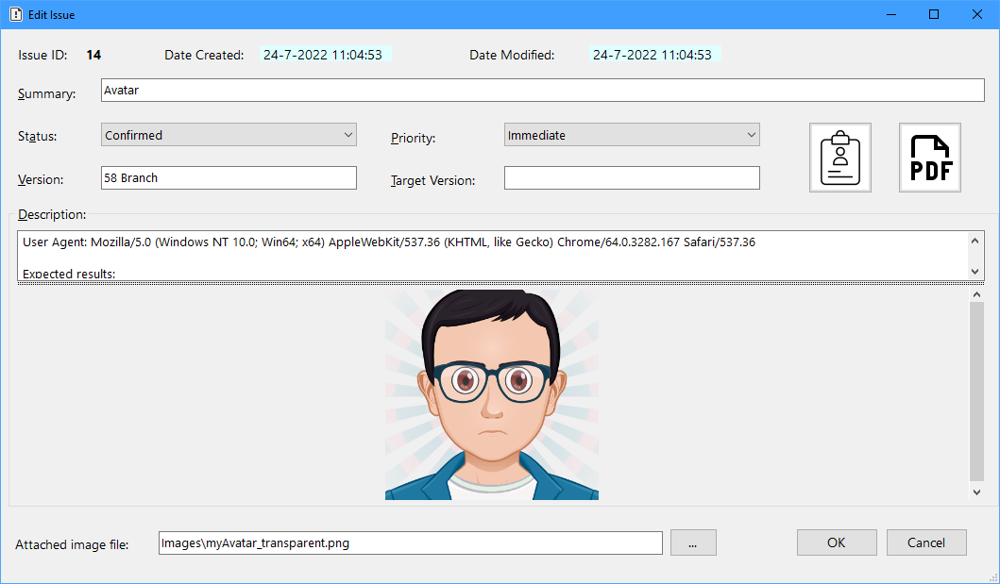
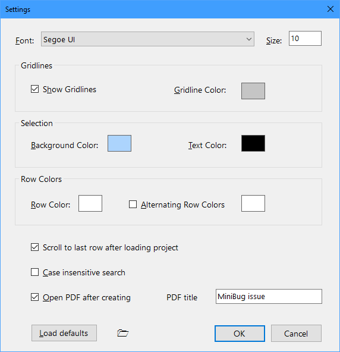

# MiniBug v2 - Issue Tracker and To-do List

This is a fork of MiniBug for VS2019 and .NET 4.8.

Some of the changes:
- Removed missing MiniBug_TemporaryKey.pfx and signing from project
- Default fontsize set to 10
- Scale forms after changing fontsize in settings
- Load project on startup if only one project exists
- Optionally attach an image to an issue
- Create single exe using Fody.Costura, https://github.com/Fody/Costura
- Show a ModernUI.Charting pie chart after loading a project
- Copy issue and image to Clipboard
- Search issue

MiniBug is a barebones, simple issue tracker and to-do list. It is a Windows desktop single-user application.

MiniBug does not use a database to store data: instead the application stores each project in a .json file. This means that if you need to work on projects, in different computers, you can share a MiniBug project between computers, by putting the .json file in something like Dropbox.

Attached images are stored with their file name only, it is recommended to keep them in the same folder as the application.
Preferably keep images in a subfolder "Images", this way all data can be copied easily to another location.
When using the "Copy to clipboard" button, text and images can be pasted into office applications by using "Paste special".

## Features

- Issues: create, edit, delete, clone
- Tasks: create, edit, delete, clone
- Show/hide/sort columns
- Some user defined settings
- Export issues and tasks to CSV format

## Sample project

I've made a small sample project, with bugs and tasks copied from some applications' public bug trackers (Inkscape, Firefox, MariaDB and Kodi).

Download the file <a href="MiniBug Sample Project.json">MiniBug Sample Project.json</a> and open it in MiniBug.

# Getting Started

## Prerequisites

- Microsoft Windows 7 or higher
- Microsoft .NET Framework 4.8

# How To Use

First you need to create a new project (File > New Project), define a project name and choose a location to save it:

Next you can start adding issues and tasks:
- issues are bugs/problems
- tasks are items in a to-do list

## Issues

## Tasks

## Settings

The user can modify some settings (File > Settings) in order to customize the look and feel of the application:

Settings in action:

## Sorting

You can sort the grid rows in two ways:

- by clicking on a column header:

- by using the **Configure Columns** window:

Using the second method you can sort by up to two columns and with different criteria (ascending or descending).

## Column visibility

You can show/hide any column (except the **ID** column, which is always visible), using the **Configure Columns** window:

## Exporting

You can export a project's issues and tasks to CSV (comma separated values) files:

Because issues and tasks have a slightly different structure, they are exported to separate files. If a project only has issues or tasks, only one file will be generated:

# License

This project is licensed under the MIT License - see the LICENSE.md file for details.

# Acknowledgments

This project uses the following libraries:

- <a href="https://www.newtonsoft.com/json">Json.NET</a>: for reading/writing to .json files
- <a href="https://joshclose.github.io/CsvHelper/">CsvHelper</a>: for exporting to CSV
- <a href="https://www.codeproject.com/Articles/5299801/A-Control-to-Display-Pie-and-Doughtnut-Charts-with">Pie chart control</a>: by Angelo Cresta
- <a href="https://www.codeproject.com/Articles/570682/PDF-File-Writer-Csharp-Class-Library-Version-2-0-0">PdfFileWriter library</a>: by Uzi Granot

<a target="_blank" href="https://icons8.com/icon/EQ4HGAcEI0hH/chart">Chart</a> icon by <a target="_blank" href="https://icons8.com">Icons8</a>

<a target="_blank" href="https://icons8.com/icon/9u9JUlsiUlgh/clipboard">Clipboard</a> icon by <a target="_blank" href="https://icons8.com">Icons8</a>
